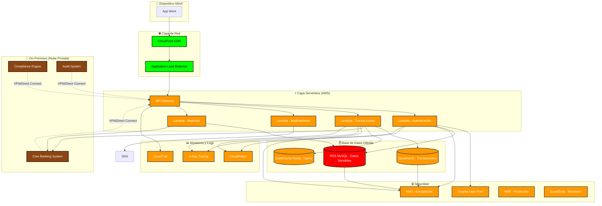

# 🏦 Arquitectura Cloud Híbrida - Aplicación de Banca Móvil

## 📊 Diagrama Arquitectónico

## 🏗️ Componentes de la Arquitectura

### **1. Capa de Presentación**
- **App Móvil**: Aplicación nativa iOS/Android
- **CDN (CloudFront)**: Distribución global de contenido estático
- **Load Balancer**: Balanceo de carga entre regiones

### **2. Capa Serverless (AWS)**
- **API Gateway**: Punto de entrada único para todas las APIs
- **Lambda Functions**:
  - **Autenticación**: Login, registro, MFA
  - **Transacciones**: Transferencias, pagos, consultas
  - **Notificaciones**: Push, SMS, email
  - **Reportes**: Extractos, análisis, compliance

### **3. Base de Datos Híbrida**
- **RDS MySQL**: Datos sensibles del cliente (on-premises)
- **DynamoDB**: Transacciones y logs (cloud)
- **Redis**: Cache de sesiones y datos frecuentes

### **4. Seguridad**
- **Cognito**: Gestión de usuarios y autenticación
- **KMS**: Encriptación de datos en reposo y tránsito
- **WAF**: Protección contra ataques web
- **GuardDuty**: Detección de amenazas

### **5. Nube Privada (On-Premises)**
- **Core Banking System**: Sistema principal de banca
- **Compliance Engine**: Motor de cumplimiento regulatorio
- **Audit System**: Sistema de auditoría

### **6. Monitoreo y Observabilidad**
- **CloudWatch**: Métricas y logs
- **X-Ray**: Trazabilidad de requests
- **CloudTrail**: Auditoría de API calls

## 🔄 Flujo de Datos

1. **Usuario** accede a la app móvil
2. **CDN** sirve contenido estático
3. **Load Balancer** distribuye tráfico
4. **API Gateway** enruta requests
5. **Lambda Functions** procesan lógica de negocio
6. **Base de Datos** almacena/recupera información
7. **Sistema On-Premises** valida operaciones críticas
8. **Servicios de Seguridad** protegen en cada capa

## 💡 Ventajas de esta Arquitectura

- **Escalabilidad**: Auto-scaling automático con Lambda
- **Seguridad**: Múltiples capas de protección
- **Cumplimiento**: Datos sensibles en infraestructura privada
- **Costos**: Pago por uso en servicios serverless
- **Disponibilidad**: Multi-región con failover automático
- **Flexibilidad**: Híbrida para cumplir requisitos regulatorios

